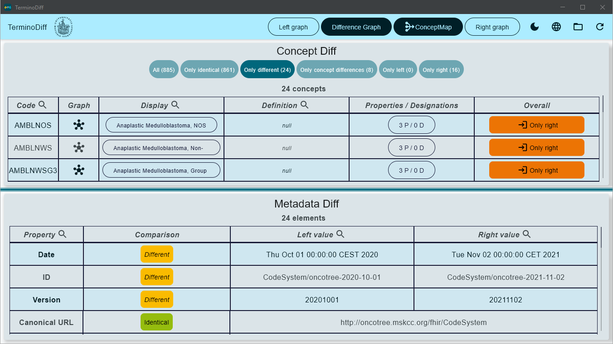
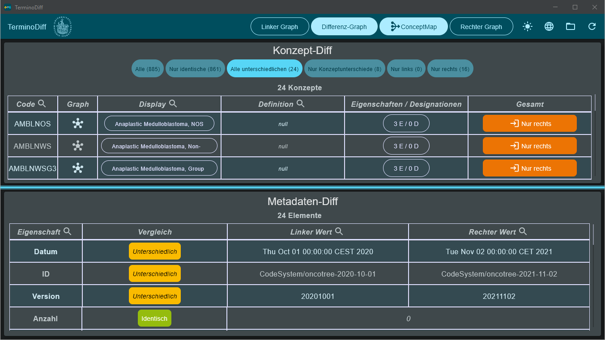
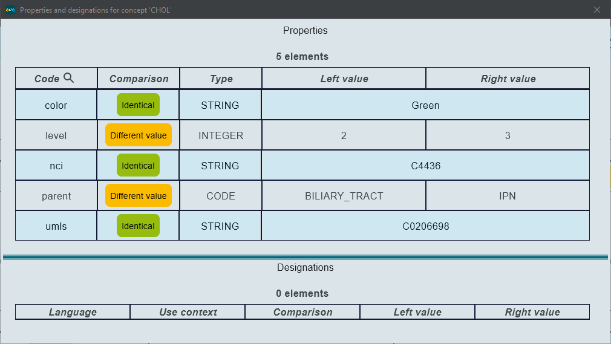
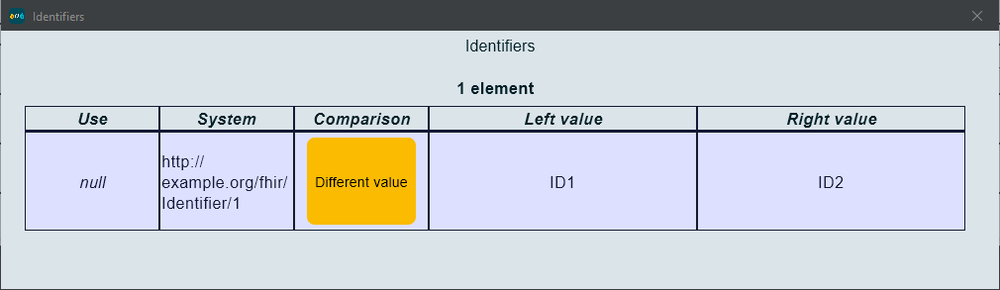
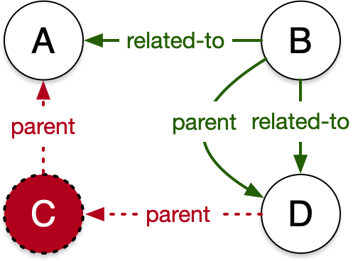

# TerminoDiff - Diff for 🔥 Terminology

[](https://doi.org/10.5281/zenodo.5898267)

TerminoDiff is a graphical application to quickly
compare [HL7 FHIR CodeSystem resources](https://www.hl7.org/fhir/codesystem.html).

## Why this app?

Determining how HL7 FHIR CodeSystem resources differ proves to be a very difficult task without specialized tooling,
since there are many aspects to consider in these resources. This makes maintenance of well-formed FHIR CodeSystem
resources much more difficult than it should be.

| Level | Aspect                    | Example(-s)                                                                                                         | TerminoDiff's Approach                                                                               |
|------:|---------------------------|---------------------------------------------------------------------------------------------------------------------|------------------------------------------------------------------------------------------------------|
|     0 | Serialization format      | JSON vs. XML                                                                                                        | Reading using HAPI FHIR allows ignoring wire format,<br>since the formats are semantically identical |
|     1 | Metadata level            |                                                                                                                     | Presentation as a table (lower half) in the GUI                                                      |
|   1.1 | Simple differences        | `title`, `name`, `version`                                                                                          | String comparisons                                                                                   |
|   1.2 | Differences within lists  | `language`, `version`                                                                                               | (keyed) difference lists, e.g. by using `language.code`<br>as the key                                |
|     2 | Concept level             |                                                                                                                     | Presentation as a table (upper half) in the GUI                                                      |
|   2.1 | Simple differences        | `display`, `designation`                                                                                            | String comparisons                                                                                   |
|   2.2 | Differences within lists  | `property`, `designation`                                                                                           | (keyed) difference lists, e.g. by using `property.code`<br>as the key                                |
|   2.3 | Unilaterality of concepts | Deletions and additions of codes /<br>concepts across versions                                                      | Surfacing within the table with dedicated filter and highlight                                       |
|     3 | Edge differences          | Deletions and additions of <br>`parent`/`child` properties;<br>other properties linking concepts<br>also considered | Creation and display of a difference graph with multiple<br>color-coded types of edges.              |

## What do I see?

When you start the application, you will have to load two HL7 FHIR CodeSystem resources. It does not matter whether the
resources are stored as JSON or XML files, the HAPI FHIR library will take care of this.

You will be able to load data from the file system, but also from a FHIR Terminology Server:


If you do not have a FHIR server on your own, you can use the following URLs:

- https://r4.ontoserver.csiro.au/fhir (a public test instance for Ontoserver, a commercial FHIR Terminology server)
- http://hapi.fhir.org/baseR4 (a public instance of HAPI FHIR JPA Server)

Once loaded, you will be presented with the view of differences over the two loaded CodeSystems:



The app is also translated into German; and a dark theme is implemented as well:



Many columns are searchable (using a fuzzy search function, so that near matches can be found as well). This is
indicated by looking glass icons. Searches can be combined as well, by specifying multiple filters.

The fuzzy search requires a partial match of at least 75 % similarity.

### Top section

In the top half of the app, you can inspect the concept differences in more detail. The filters at the top allow you to
select different subsets of the concepts - you can view all concepts; those that are identical; those that are
different (this is the default view); those where the concept is in both sides of the comparison, but different; and
those that are only in one of the two CodeSystems. Differences are highlighted using colors.

The *Properties / Designations* buttons are clickable to reveal a more detailed comparison:



If the concept is unilateral (only in left / only in right), the dialog is accessible regardless.

### Bottom section

This section represents differences in the CodeSystem metadata. Attributes are represented as rows in the table, and the
respective value is shown in the right-hand part. Every metadata comparison item is compared and represented using
colored chips.

If the value is identical, the columns are merged, otherwise there will be a left and a right value. For properties that
are lists of values in FHIR, such as `Identifier`, the colored chip will be a clickable button (as long as there is data
in that property):



### Difference Graph

At the very top of the app, there are three buttons to view a graphical representation of the two CodeSystems, as well
as the computed difference graph. To illustrate, consider these two CodeSystems:

| Left CS                                       | Right CS                                        |
|-----------------------------------------------|-------------------------------------------------|
|  |  |

Going from "left" to "right", the concept `C` was removed, leading to changes in the edge going from `D` to `A`. Also, a
new type of edge, `related-to` was introduced.

The dashed edges `child` are special, since these are handled internally as `parent` edges. This is since FHIR specifies
three ways of handling `parent-child` relationships:

1. the `concept` property within `concept`, allowing arbitrarily deep nesting,
2. the implicit `parent` property,
3. and/or the implicit `child` property.

Since these properties are to
be [handled in the same fashion by implementing applications](https://www.hl7.org/fhir/codesystem.html#hierarchy), we
reduce all of these three options to the "canonical" `parent` property (which allows a poly-hierarchy, which `concept`
does not).

The difference graph for these two fictitious CodeSystem resources could look like this:



Red and dotted edges refer to deletions (going from left to right), while green solid edges refer to insertions.

The difference graph implemented in the application looks very similar:


At the top of the dialog, you can choose from any of the available layout algorithms. Since CodeSystems generally have
directed edges, and are often hierarchical, we find that the *Sugiyama* and *Eiglsperger* algorithms do a fine job at
visualizing these graphs.

## How do I run this?

There are executable
distributions [available under the Releases section](https://github.com/itcr-uni-luebeck/TerminoDiff/releases/latest).

Executables are available for:

* Windows 64-bit
* macOS Intel x64 (built on Monterey)
* macOS aarch64 (built on Monterey)
* Debian and derivatives, 64-bit (built on Ubuntu)
* RPM-based distributions, 64-bit (built on Fedora)

These releases include a Java VM and the needed run-time components, and can be run as-is. The macOS binaries are
code-signed, but not notarized by Apple, and may ask for permission to run.

You can build the project yourself using Gradle, either from the console or via an IDE such as IntelliJ. If you want to
build a native distribution yourself, you might need to edit the `build.gradle.kts` to only include the operating system
and target format you require - cross-building is not yet supported by the Compose Desktop framework.

If you want to run from code, use at least JDK 11. If you want to build a native distribution, you need JDK 15 or
later (17 recommended), since `jpackage` is not available in prior versions.

## How is this built?

The application is written in Kotlin and utilizes [JetBrains' *Compose
Multiplatform*](https://github.com/JetBrains/compose-jb) toolkit. This toolkit brings the declarative *Jetpack Compose*
library from Android over to the desktop, allowing a Kotlin-first approach to GUI development.

We utilize the following libraries alongside *Compose*:

- [HAPI FHIR](https://hapifhir.io) for processing FHIR resources
- [slf4j](https://www.slf4j.org) for logging
- [JGraphT](https://jgrapht.org) for representation of CodeSystem and diff graphs
- [jungrapht-visualization](https://github.com/tomnelson/jungrapht-visualization) for drawing the graphs (using Swing)
- [colormap](https://github.com/mahdilamb/colormap) for the colormap in the graph visualizations
- [NativeJFileChooser](https://github.com/veluria/NativeJFileChooser) for the file selection dialog on Windows and Linux
- [Apache Commons Lang](https://commons.apache.org/proper/commons-lang/)
- [FlatLaf](https://www.formdev.com/flatlaf/) for dark window chrome on Windows
- [ktor](https://ktor.io) for coroutine-based HTTP
- [JavaWuzzy](https://github.com/xdrop/fuzzywuzzy) for fuzzy string matching, a port
  of [FuzzyWuzzy](https://pypi.org/project/fuzzywuzzy/) in Python
- [RSyntaxTextArea](https://github.com/bobbylight/RSyntaxTextArea) for the JSON editor in the `ConceptMap` panel

### Localization

The localization framework was built from scratch in the
file [LocalizedStrings.kt](src/main/kotlin/terminodiff/i18n/LocalizedStrings.kt), since no suitable alternative for
localization in Kotlin could be found. Currently, we support English (default) and German strings. Every component that
displays strings receives an instance of `LocalizedStrings`, which declares a number of properties that are implemented
in `EnglishStrings` and `GermanStrings`. Default arguments in `LocalizesStrings` represent strings that are identical in
English and German - if you implement another language, you may need to make some default properties explicit in the
derived classes.

Members with a trailing underscore represent formatting functions that are implemented as Lambda expressions. These are
referenced from the GUI using `localizesStrings.member_.invoke(param1, param2)`.

### Tables

Since `DataTables` are not (anymore) part of the Compose toolkit, we implemented our own table component. The generic
implementation takes in a list of column specifications that render the provided type parameter using a composable body.
The table supports merging adjacent columns (if a predicate returns `true`), tooltips (e.g. on the lower table, when
English is not selected as the language, the default name of the FHIR attribute is shown in the tooltip of the left-hand
column), and zebra striping. In the top table, the table data is also pre-filtered using a generic set of filter
buttons. Column specs can declare that they are searchable, which yields a search button next to the column name. Search
parameters can be combined at will.

### Graph window

While interoperability between Kotlin and Java is generally very good, the `jungrapht-visualization` library is better
called from Java than from Kotlin. Also, the performance of integrating these heavy components into the composable
framework is not sufficient, so that these windows are implemented using Swing instead of Compose.

The Swing code makes liberal use of the sample implementations in
the [jungrapht-visualization](https://github.com/tomnelson/jungrapht-visualization) libraries, e.g. for the
rubber-banding satellite viewer. The graph viewer supports a range of mouse
operations, [explained in more detail in the documentation](https://github.com/tomnelson/jungrapht-visualization/blob/master/MouseGestures.md)
.

## Metadata differences

We have implemented a very generic difference engine for the metadata table, so that new diff items can be added very
easily. Most elements are basically string comparisons, which can be added using a single line of code
in [MetadataDiffItems.kt](src/main/kotlin/terminodiff/engine/metadata/MetadataDiff.kt) (
function `generateComparisonDefinitions`). Stuff like `identifiers` are a bit more involved, since these require the
definition of a key and a string representation of the value, as well as column definitions for the key columns (to
render the details dialog shown above), but are also not very challenging to implement.

## What's planned?

We are looking at implementing the following features:

- [x] a search for concepts in the CodeSystems by `code` and other characteristics
- [x] filters for the metadata table, similar to those in the concept table
- [x] query of resources from FHIR Terminology servers (by physical URL and canonical URL plus version)
- [x] support for the `vread` mechanism to compare across instance versions on FHIR Terminology servers
- [ ] a visualization of the neighborhood of any concept in the graph, to view the connections a concept has across the
  network of concepts
    - integrating this feature into the difference graph, so that layers of context can be added iteratively
- support for other types of resources in FHIR, especially `ValueSet` and `ConceptMap`, likely with TS support.

## How do I cite this?

This work is the subject of a submission to the Medical Informatics Europe 2022 conference.

In the meantime, please cite via the [Zenodo DOI](https://doi.org/10.5281/zenodo.5898267) as:

```
Wiedekopf, Joshua, et al. (2022). TerminoDiff. Zenodo. https://doi.org/10.5281/zenodo.5898267
```

## Can I help?

Absolutely 🔥! Please feel free to open an issue if you would like another feature added to the app. We are committed to
improving on this app to provide a better experience for terminologists around the globe.

If you improve on this app, we only ask that your changes remain freely accessible, and that you create a pull request
on GitHub. Thanks!
