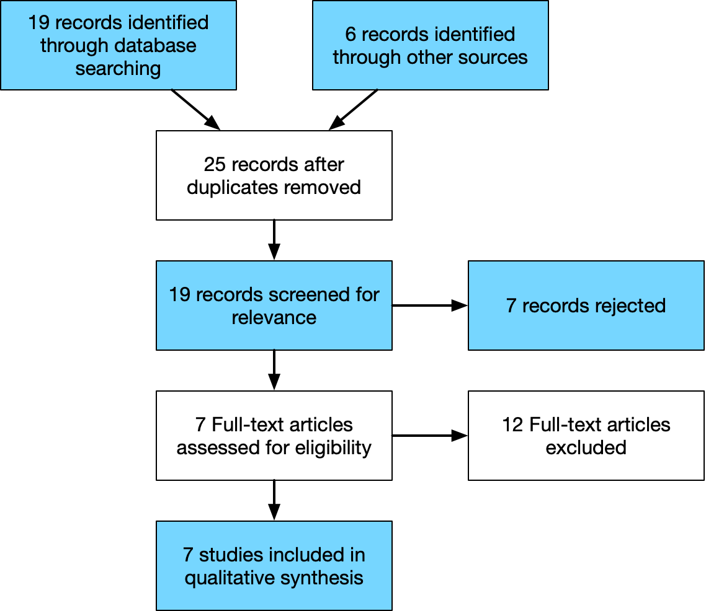

To get an overview of the literature, we performed a scoping review.



Our PICOC are:
- Population = Terminology Tooling
- Intervention = Differences in resource versions
- Comparison = GNU `diff`
- Outcome = Changes made visible and understandable
- Context = healthcare informatics.

We derived the following search string from the PICOC:

```
("fhir" OR "ontology" OR "rdf" OR "terminology") AND ("diff" OR "change" OR "difference" OR "version")
```

We queried the following sources:

- PubMed
- Scopus
- Springer Link
- other (we added sources that were referenced in other literature to this group)

Our inclusion and exclusion criteria are:

|Inclusion|Exclusion|
|-|-|
|Does the approach consider HL7 FHIR resources?|No free-text available|
|Does the approach consider terminological artefacts?|The approach does not consider terminological/ontological artefacts|
|The approach computes a diff|The approach is not from the medical domain|

By querying the three sources using the search string, and adding references to the "other" category, we selected 25 studies in total (Scopus 12, Springer Link 4, PubMed 3, other 6), based on their abstracts.

After abstract selection, we screened the papers using the following screening questions:

- Applicability to this work?
- Does the approach consider the representation and maintenance of terminological/ontological artefacts?

After screening, we selected the following six works as applicable:

- Hartung, Michael, Anika Groß, and Erhard Rahm. “COnto–Diff: Generation of Complex Evolution Mappings for Life Science Ontologies.” Journal of Biomedical Informatics 46, no. 1 (February 2013): 15–32. https://doi.org/10.1016/j.jbi.2012.04.009.
- Kirsten, Toralf, Michael Hartung, Anika Groß, and Erhard Rahm. “Efficient Management of Biomedical Ontology Versions.” In Lecture Notes in Computer Science, 574–83. Springer Berlin Heidelberg, 2009. https://doi.org/10.1007/978-3-642-05290-3_71.
- Klein, Michel, Dieter Fensel, Atanas Kiryakov, and Damyan Ognyanov. “Ontology Versioning and Change Detection on the Web.” In Knowledge Engineering and Knowledge Management: Ontologies and the Semantic Web, 197–212. Springer Berlin Heidelberg, 2002. https://doi.org/10.1007/3-540-45810-7_20.
- Noy, Natalya Fridman, and Mark A. Musen. “PROMPTDIFF: A Fixed-Point Algorithm for Comparing Ontology Versions.” In Proceedings of the Eighteenth National Conference on Artificial Intelligence and Fourteenth Conference on Innovative Applications of Artificial Intelligence, July 28 - August 1, 2002, Edmonton, Alberta, Canada, edited by Rina Dechter, Michael J. Kearns, and Richard S. Sutton, 744–50. AAAI Press / The MIT Press, 2002. http://www.aaai.org/Library/AAAI/2002/aaai02-112.php.
- Ochs, Christopher, Yehoshua Perl, James Geller, Melissa Haendel, Matthew Brush, Sivaram Arabandi, and Samson Tu. “Summarizing and Visualizing Structural Changes during the Evolution of Biomedical Ontologies Using a Diff Abstraction Network.” Journal of Biomedical Informatics 56 (August 2015): 127–44. https://doi.org/10.1016/j.jbi.2015.05.018.
- Pernisch, Romana, Mirko Serbak, Daniele Dell’Aglio, and Abraham Bernstein. “ChImp: Visualizing Ontology Changes and TheirImpact in Protégé.” Visualization and Interaction for Ontologies and Linked Data (VOILA), 2020. http://ceur-ws.org/Vol-2778/paper5.pdf.
- Swoboda, Oliver. “Realisierung Des COnto-Diff Algorithmus Innerhalb Eines Protégé-Plugins.” Bachelor’s Thesis, Universität Leipzig, Institut für Informatik, Abteilung Datenbanken, 2015. https://nbn-resolving.org/urn:nbn:de:bsz:15-qucosa2-171988.

We then extracted the following data from the referenced literature:

- What is the underlying terminological model? (select from FHIR, RDF/OWL, other)
- Is the result visualized in some fashion? (Boolean)
- Is a graph being generated? (Boolean)
- Mapping from one version to another? (Boolean)
- Comments (Free-text)
